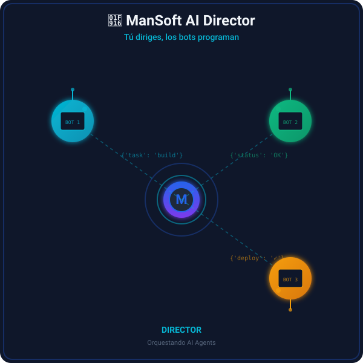

<!-- Este repo se debe llamar EXACTAMENTE "LN42352339" para que el README salga en tu perfil -->
<!-- IMPORTANTE: si editas esto en la web de GitHub, usa el modo "Edit" (texto), NO pegues texto ya formateado: se pierde el markup -->

<h1 align="center">Hola 👋 Soy Mansoft</h1>
<h3 align="center">Desarrollador de aplicaciones móviles · Automatización con IA · React Native + TypeScript + Firebase</h3>

  

  

  

  

---

## 🧑‍💻 Sobre mí

- 📱 Construyo apps móviles multiplataforma con **React Native (CLI)** y **TypeScript**
- 🔥 Backend con **Firebase**: Authentication, Cloud Firestore y Storage
- 🤖 **Automatización con n8n** e integraciones de APIs (Google, WhatsApp, OCR, ETL)
- 🧭 Navegación con **React Navigation** (stack + bottom tabs)
- 🛠️ Actualmente en **Directorio**, app de gestión de contactos y equipos de votación (iOS en TestFlight, `v1.0.6`)
- 💼 **Tech Lead en CEVA Logistics** (2015 – Presente)
- 📍 Lima, Perú 🇵🇪
- 📫 **manpooh7@gmail.com**

---

## 🧰 Stack & herramientas

---

## 📌 Proyectos destacados

| Proyecto | Descripción | Tecnologías |
|---|---|---|
| [**mansoft-avatar**](https://github.com/LN42352339/mansoft-avatar) | Avatar animado — Director de AI Agents. Muestra automatización con bots. | HTML5 · CSS3 · SVG · Animaciones |
| [**congresocontactos**](https://github.com/LN42352339/congresocontactos) | App *Directorio*: contactos, roles de admin y equipos de votación. Publicada en TestFlight (iOS). | React Native · TypeScript · Firebase |
| [**gestion-contactos-api**](https://github.com/LN42352339/gestion-contactos-api) | API para la gestión de contactos. | TypeScript |
| [**marvel**](https://github.com/LN42352339/marvel) | Consumo de API y listados con React Native. | React Native · TypeScript |
| [**proyectomovil2**](https://github.com/LN42352339/proyectomovil2) | Proyecto del curso de Aplicaciones Móviles 2. | Kotlin · React Native |

---

## 🌟 Habilidades clave

**🤖 Automatización & APIs**

**📱 Desarrollo móvil**

**🗄️ Backend & bases de datos**

**🤝 Soft skills** · Liderazgo de equipos · Resolución de problemas complejos · Comunicación efectiva · Orientación a resultados

---

## 🎓 Educación & certificaciones

- 🎯 **Técnico en Desarrollo de Sistemas de Información** — IDAT (2023) · *Top 10% de la clase*
- 📱 **Desarrollo de Aplicaciones Móviles con Kotlin** — CETI (2024)
- 🐘 **PHP con Laravel** — ISI Instituto Internacional de Software (2024)
- 📊 **Especialista en Datos Nivel 1 & 2** — Movistar / AMED
- 🎨 **HTML & Bootstrap** — Netzun (2024)

---

## 📊 Estadísticas de GitHub

  

  
  

  
  

  

---

## 🌍 Idiomas

---

## 💡 Filosofía

> **"Tú diriges, los bots programan."** — ManSoft

Creo en la automatización inteligente que libera tiempo para lo que realmente importa. Cada proyecto es una oportunidad para mejorar la eficiencia operativa y entregar soluciones escalables.

---

## 📫 Conecta conmigo

  
  

<i>Construyendo el futuro, un automatismo a la vez. 🚀</i>

